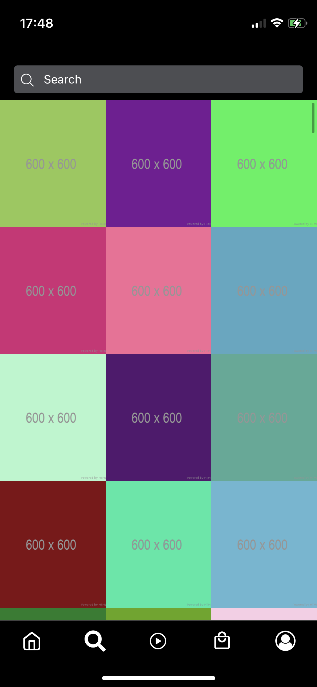
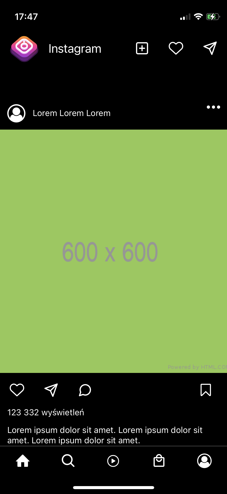

# Instagram Clone

React Native Application - Instagram Clone

Basic functionalities:

- Browse pics
- Scroll photos up and down.
- Switching between screen using the
  Bottom Tab Navigator.
- Displaying a list of photos in the form of a grid
- Displaying a photo on a new one
  screen after clicking on a thumbnail from the list.

## Setup

    npm install
    npm run start

## Technologies

- React - version 18.2.0
- React Native - version 0.70.5
- Lottie
- Tanstack/react-query
- Expo

## Project Status

Project is: completed

## Demo

